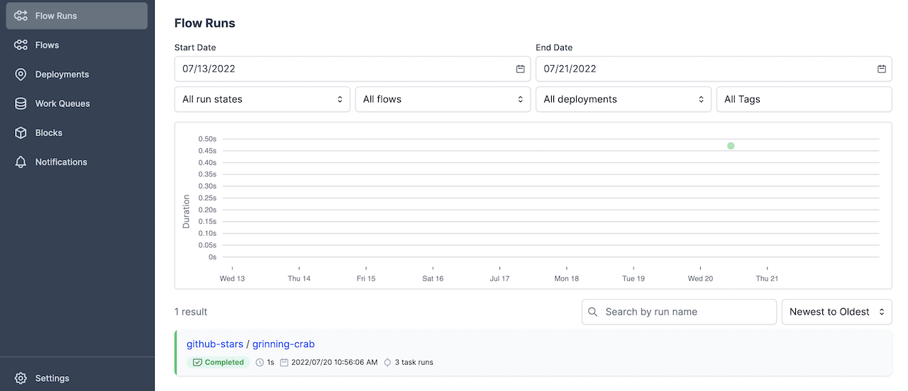
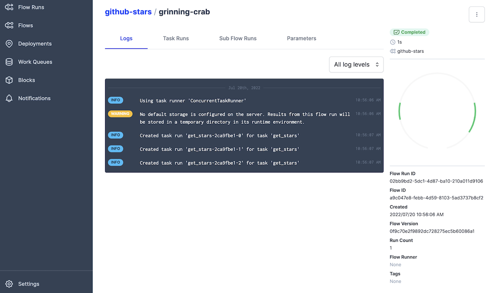

#

## Welcome to Prefect!

Prefect is Air Traffic Control for your dataflows. It's the coordination plane that provides you with everything from dataflow observability to dataflow orchestration. 

## Why Prefect?

If you move data, you probably need the following functionality:

- [schedules](concepts/schedules/)
- [retries](concepts/tasks/#task-arguments)
- [logging](concepts/logs/)
- [caching](concepts/tasks/#caching)
- [notifications](ui/notifications/)
- [observability](/ui/overview/)

Implementing all of these features for your dataflows is a huge pain that takes a lot of time &mdash; time that could be better used for functional code.

That's why Prefect 2.0 offers all this functionality and more! 

To dive right in, simply sprinkle in a few decorators and add a little configuration, like the example below. 
## Basic example

This code fetches data about GitHub stars for a few repositories. Add the three highlighted lines of code to your functions to use Prefect, and you're off to the races! 


```python hl_lines="1 4 10"
from prefect import flow, task
import httpx

@task(retries=3)
def get_stars(repo):
    url = f"https://api.github.com/repos/{repo}"
    count = httpx.get(url).json()["stargazers_count"]
    print(f"{repo} has {count} stars!")

@flow
def github_stars(repos):
    for repo in repos:
        get_stars(repo)

# call the flow!
github_stars(["PrefectHQ/Prefect", "PrefectHQ/prefect-aws",  "PrefectHQ/prefect-dbt"])
```

Run the code:

```bash
python github_stars_example.py
```

And see the logger's output in your terminal:

```bash
10:56:06.988 | INFO    | prefect.engine - Created flow run 'grinning-crab' for flow 'github-stars'
10:56:06.988 | INFO    | Flow run 'grinning-crab' - Using task runner 'ConcurrentTaskRunner'
10:56:06.996 | WARNING | Flow run 'grinning-crab' - No default storage is configured on the server. Results from this flow run will be stored in a temporary directory in its runtime environment.
10:56:07.027 | INFO    | Flow run 'grinning-crab' - Created task run 'get_stars-2ca9fbe1-0' for task 'get_stars'
PrefectHQ/Prefect has 9579 stars!
10:56:07.190 | INFO    | Task run 'get_stars-2ca9fbe1-0' - Finished in state Completed()
10:56:07.199 | INFO    | Flow run 'grinning-crab' - Created task run 'get_stars-2ca9fbe1-1' for task 'get_stars'
PrefectHQ/prefect-aws has 7 stars!
10:56:07.327 | INFO    | Task run 'get_stars-2ca9fbe1-1' - Finished in state Completed()
10:56:07.337 | INFO    | Flow run 'grinning-crab' - Created task run 'get_stars-2ca9fbe1-2' for task 'get_stars'
PrefectHQ/prefect-dbt has 12 stars!
10:56:07.464 | INFO    | Task run 'get_stars-2ca9fbe1-2' - Finished in state Completed()
10:56:07.477 | INFO    | Flow run 'grinning-crab' - Finished in state Completed('All states completed.')
```

By adding `retries=3 ` to the `@task` decorator, the `get_stars` function automatically reruns up to three times on failure!

**Observe your flow runs in the Prefect UI**

Fire up the Prefect UI locally by entering this command in your terminal:

```bash
prefect orion start
```

Follow the link in your terminal to see the dashboard.



Click on your flow name to see logs and other details.


## Prefect highlights
**Graceful failures**

Inevitably dataflows will fail. Prefect helps your code automatically retry on failure. 

**Notifications**

You can easily set up e-mail or Slack notifications so that the right people are notified when something doesn't go as planned. 

**Designed for performance**

Prefect 2.0 has been designed from the ground up to handle the dynamic, scalable workloads that today's dataflows demands. 

**Integrates with other modern data tools**

Prefect has [integrations](collections/overview/) for all the major cloud providers and modern data tools such as Snowflake, Databricks, dbt, Airbyte, and Fivetran. 

**Async and parallelization options**

Prefect provides [concurrency and sequential execution options](concepts/task-runners/). With a single import and one argument to your flow decorator you can set up parallel processing across clusters with Dask and Ray integrations. 

**Works well with containers**

Prefect is often used with [Docker and Kubernetes](concepts/deployments/#packaging-flows). Prefect can even package your flow directly into a Docker image. 

**Security first**

Prefect helps you keep your data and code secure. Prefect's patented [hybrid execution model](https://www.prefect.io/why-prefect/hybrid-model/) means your data can stay in your environment while Prefect Cloud orchestrates your flows. Prefect, the company, is SOC2 compliant and our enterprise product makes it easy for you to restrict access to the right people in your organization.

**A user friendly, interactive dashboard for your dataflows**

In the [Prefect Orion UI](ui/overview/) you can quickly set up notifications, visualize run history, and schedule your dataflows.  

**Faster and easier than building from scratch**

It's estimated that up to 80% of a data engineer's time is spent writing code to guard against edge cases and provide information when a dataflow inevitably fails. Building the functionality that Prefect 2.0 delivers by hand would be a significant cost of engineering time. 

**Flexible** 

Some workflow tools require you to make DAGs (directed acyclic graphs). DAGs represent a rigid framework that is overly constraining for modern, dynamic dataflows. Prefect 2.0 allows you to create dynamic dataflows in native Python - no DAGs required. 

**Incremental adoption**

Prefect 2.0 is designed for incremental adoption. You can decorate as many of your dataflow functions as you like and get all the benefits of Prefect as you go!

!!! info "Don't Panic"
    Prefect 2.0 is under active development and may change rapidly. For production use, we recommend [Prefect 1.0](https://github.com/prefecthq/prefect).
---

## Expanded examples

Let's show how the aforementioned basic example can be expanded on to add parallelism or async concurrency!

### Parallel execution

Control the task execution environment by changing a flow's `task_runner`. 
The tasks in this flow, using the `DaskTaskRunner`, will automatically be submitted to run in parallel on a [Dask.distributed](http://distributed.dask.org/) cluster:

```python hl_lines="2 11"
from prefect import flow, task
from prefect.task_runners import DaskTaskRunner
import httpx

@task(retries=3)
def get_stars(repo):
    url = f"https://api.github.com/repos/{repo}"
    count = httpx.get(url).json()["stargazers_count"]
    print(f"{repo} has {count} stars!")

@flow(name="GitHub Stars", task_runner=DaskTaskRunner())
def github_stars(repos):
    for repo in repos:
        get_stars(repo)

# call the flow!
if __name__ == "__main__":
    github_stars(["PrefectHQ/Prefect", "PrefectHQ/prefect-aws",  "PrefectHQ/prefect-dbt"])
```

### Async concurrency

Prefect 2.0 ships with native async support. 
Flows can include a mix of synchronous and asynchronous tasks, just like native Python.

```python hl_lines="3 6-8 13-14 17"
from prefect import flow, task
import httpx
import asyncio

@task(retries=3)
async def get_stars(repo):
    async with httpx.AsyncClient() as client:
        response = await client.get(f"https://api.github.com/repos/{repo}")
    count = response.json()["stargazers_count"]
    print(f"{repo} has {count} stars!")

@flow(name="GitHub Stars")
async def github_stars(repos):
    await asyncio.gather(*[get_stars(repo) for repo in repos])

# call the flow!
asyncio.run(github_stars(["PrefectHQ/Prefect", "PrefectHQ/prefect-dbt"]))
```

The above examples just scratch the surface of how Prefect can help you coordinate your dataflows.

---

## Using the docs

Prefect 2.0 was designed for incremental adoption into your workflows. The documentation is organized to support your exploration. Here are a few sections you might find helpful:

**Getting started**

Begin by [installing Prefect 2.0](getting-started/installation.md) on your machine, then follow one of our [friendly tutorials](tutorials/first-steps) to learn by example. See the [Getting Started overview](getting-started/overview) for more.

**Concepts**

Learn more about Prefect 2.0's features and design by reading our in-depth [concept docs](concepts/overview.md). The concept docs are intended to introduce the building blocks of Prefect, build up to orchestration and deployment, and finally cover some of the advanced use cases that Prefect makes possible.

**Prefect UI & Prefect Cloud**

See how [Prefect's UI and cloud hosted functionality](ui/overview/) can make orchestrating dataflows a joy.

**Collections**

Prefect integrates with the other tools of the modern data stack. In our [collections docs](collections/overview) learn about our pre-built integrations and see how to add your own.

**Frequently asked questions**

Prefect 2.0 represents a fundamentally new way of building and orchestrating dataflows. You can find responses to common questions by reading our [FAQ](faq.md) and checking out the [Prefect Discourse](https://discourse.prefect.io/).

**API reference**

Prefect 2.0 provides a number of programmatic workflow interfaces, each of which is documented in the [API Reference](api-ref/overview). This section is where you can learn how a specific function works, or see the expected payload for a REST endpoint.

**Contributing**

Learn how [you can get involved](contributing/overview/).

Prefect 2.0 was made possible by the fastest-growing community of data practitioners. The [Prefect Slack community](https://prefect.io/slack) is a fantastic place to learn more, ask questions, or get help with workflow design. 

The [Prefect Discourse](https://discourse.prefect.io/) is an additional community-driven knowledge base to find answers to your Prefect-related questions. 


## Next steps

Follow the [Getting Started docs](getting-started/overview/) and start building!

While you're at it [give Prefect a ⭐️ on GitHub](https://github.com/PrefectHQ/prefect) and join the thousands of community members in [our Slack community](https://www.prefect.io/slack). 

Thank you for being part of the mission to coordinate the world's dataflow and, of course, **happy engineering!**
